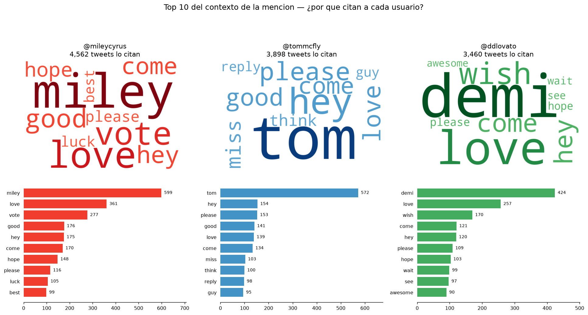
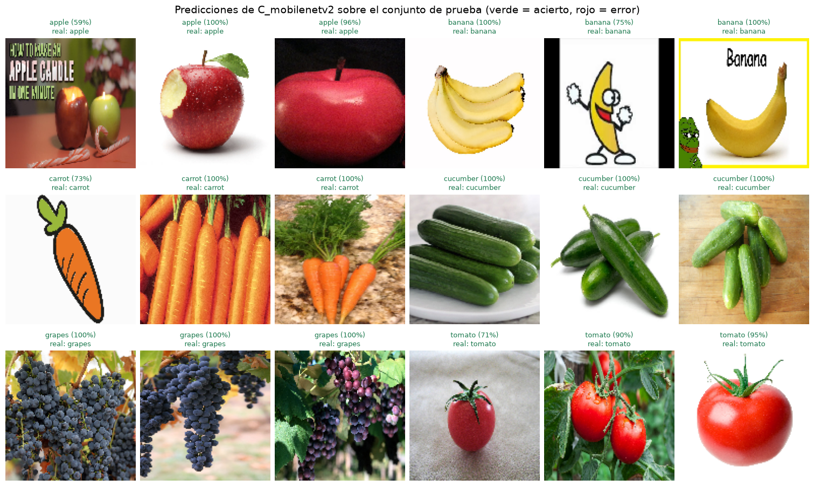

# Proyecto Final — Text Mining & Image Recognition

Postgrado en Análisis y Predicción de Datos · Tercer Trimestre, 2026 · Universidad Galileo

Un notebook por ejercicio, cada uno preparado para su entorno:

| Notebook | Problema | Dónde se ejecuta | Estado |
|---|---|---|---|
| [`Problema1_WordCloud.ipynb`](Problema1_WordCloud.ipynb) | 1 — Word Cloud | ☁️ **Google Colab** | ✅ ejecutado, con salidas embebidas |
| [`Problema2_CNN_Frutas.ipynb`](Problema2_CNN_Frutas.ipynb) | 2 — Fruits & Vegetables Recognizer | 💻 **VS Code (local)** | ✅ ejecutado, con salidas embebidas |

---

## Estructura

```
Proyecto_final/
├── Problema1_WordCloud.ipynb     <- Problema 1 (Colab)
├── Problema2_CNN_Frutas.ipynb    <- Problema 2 (VS Code local)
├── requirements.txt
├── README.md
├── Enunciado/
│   └── HT3.pdf
├── datos/                        <- no versionado (ver .gitignore)
│   └── tw_source.csv             <- 1.6 M tweets, 239 MB
└── salidas/
    ├── problema1/                <- wordclouds, corpus CSV, gráficas
    └── problema2/                <- se llena al ejecutar el Problema 2
```

## Cómo ejecutarlo

### Problema 1 — en Google Colab

Como pide el enunciado. No requiere configuración previa:

1. Suba `Problema1_WordCloud.ipynb` a Colab (`Archivo → Subir notebook`).
2. `Entorno de ejecución → Ejecutar todo`. Basta con CPU; tarda **3–4 minutos**.
3. La primera celda instala `wordcloud`/`nltk`/`kagglehub` solo si detecta Colab, y la sección
   1.1 descarga el dataset automáticamente.

También corre sin cambios en local si `datos/tw_source.csv` ya existe.

### Problema 2 — en VS Code

```powershell
python -m venv C:\venvs\tmir      # ruta corta y fuera de OneDrive (ver nota abajo)
C:\venvs\tmir\Scripts\activate
pip install -r requirements.txt
```

En macOS/Linux basta con `python -m venv .venv && source .venv/bin/activate`.

Abra `Problema2_CNN_Frutas.ipynb`, elija el kernel de ese entorno (`Select Kernel` →
`Python Environments`) y `Run All`. Requiere las extensiones *Python* y *Jupyter* de VS Code.

> ⚠️ **Windows: cree el venv en una ruta corta.** TensorFlow instala cabeceras C++ con rutas de
> más de 130 caracteres. Si el venv vive dentro de la carpeta del proyecto —que en OneDrive ya
> ocupa ~122 caracteres— se supera el límite `MAX_PATH` de 260 y la instalación aborta con
> `OSError: [Errno 2] No such file or directory: ...file_external_account_credentials.h`.
> Un venv en `C:\venvs\tmir` (13 caracteres) resuelve el problema y además evita que OneDrive
> sincronice las decenas de miles de archivos de `site-packages`.
> *Alternativa:* habilitar rutas largas con
> `LongPathsEnabled = 1` en `HKLM:\SYSTEM\CurrentControlSet\Control\FileSystem` (requiere
> permisos de administrador).

> ⚠️ **Keras 2 vs. Keras 3.** El enunciado exige `ImageDataGenerator` y `flow_from_directory`,
> que fueron **eliminados en Keras 3** (el default de TensorFlow ≥ 2.16). Por eso
> `requirements.txt` incluye `tf-keras` y el notebook activa `TF_USE_LEGACY_KERAS=1` antes de
> importar TensorFlow. Si el `assert` de la celda de entorno falla, instale `tf-keras` y
> **reinicie el kernel**.

> 🖥️ **GPU.** TensorFlow ≥ 2.11 **no soporta GPU en Windows nativo** (requiere WSL2 o
> TensorFlow-DirectML), así que el entrenamiento correrá en CPU. El notebook lo detecta y usa
> 20 épocas en vez de 40; con un dataset de este tamaño es perfectamente viable.

## Datos

Ningún dataset se versiona en Git: `tw_source.csv` pesa **239 MB** y GitHub rechaza archivos de
más de 100 MB. Ambos notebooks los descargan solos con `kagglehub`, que necesita el token de
Kaggle (*kaggle.com → Settings → API → Create New Token* → guardar `kaggle.json` en
`~/.kaggle/`). Cada notebook documenta también la alternativa manual.

| Problema | Dataset | Destino |
|---|---|---|
| 1 | [Sentiment140](https://www.kaggle.com/datasets/kazanova/sentiment140) (1.6 M tweets) | `datos/tw_source.csv` |
| 2 | [Fruit and Vegetable Image Recognition](https://www.kaggle.com/datasets/kritikseth/fruit-and-vegetable-image-recognition) | `datos/fruit-and-vegetable-image-recognition/` |

---

## Problema 1 — Resultados

**Los 3 usuarios más populares** (medidos como el número de tweets distintos que los citan,
extraídos con la regex `@(\w{1,15})` sobre 1,600,000 tweets y 343,632 handles distintos):

| # | Usuario | Tweets que lo citan | Quién es |
|---|---|---|---|
| 1 | `@mileycyrus` | 4,562 | Miley Cyrus — *Hannah Montana* |
| 2 | `@tommcfly` | 3,898 | Tom Fletcher — vocalista de McFly |
| 3 | `@ddlovato` | 3,460 | Demi Lovato — cantante y actriz |

**Top 10 del contexto de la mención** (ventana de ±5 palabras alrededor del handle, sin
stopwords, lematizado):



**¿Por qué los citan?** Los tres son celebridades del pop adolescente de 2009 (el dataset se
recolectó entre abril y junio de ese año). El contexto revela que **no se habla *sobre* ellos
sino *con* ellos**: la palabra más frecuente en los tres casos es el vocativo —el nombre de
pila— seguido de `hey` y `please`. A partir de ahí, cada uno tiene su matiz:

- **@mileycyrus** → `vote`, `luck`, `best`: campañas de votación para premios de 2009.
- **@tommcfly** → `reply`, `guy`, `think`: el más conversacional; lo citan esperando respuesta.
- **@ddlovato** → `wish`, `come`, `wait`, `see`: peticiones de conciertos y giras.

El desarrollo completo, con la evidencia en tweets reales y la comparación stemming vs.
lemmatización, está en la sección 1.7 de `Problema1_WordCloud.ipynb`.

**Salidas generadas** en `salidas/problema1/`: los tres corpus en CSV (`Content` + metadata
`ID`, `Timestamp`, `Length`), los wordclouds individuales y combinados, el ranking de usuarios
y la distribución del metadato `Length`.

---

## Problema 2 — Resultados

Dataset: 6 clases del *Fruit and Vegetable Image Recognition* de Kaggle —
**511 train / 57 validation / 59 test**. Entrenado en CPU, 15.9 min los tres modelos.

| Modelo | Params entrenables | Épocas | Train | Val | **Test acc** | **Test loss** |
|---|---|---|---|---|---|---|
| **C — MobileNetV2 (transfer learning)** | **164,742** | 12 | 0.961 | **1.000** | **1.000** | **0.062** |
| B — Profunda + BatchNorm | 1,240,550 | 18 | 0.851 | 0.912 | 0.915 | 0.314 |
| A — Baseline | 4,288,454 | 19 | 0.830 | 0.895 | 0.898 | 0.480 |



**Gana C con 100% en test**, entrenando **26 veces menos parámetros** que el baseline. Con solo
511 imágenes de entrenamiento, reutilizar los filtros que MobileNetV2 ya aprendió sobre ImageNet
rinde más que añadir capacidad: A necesita 19 épocas para llegar a 89.8%, mientras C alcanza el
100% de validación en la época 4.

> ⚠️ El conjunto de prueba tiene 59 imágenes, así que «100%» significa *no falló en ninguna de
> las 59*, no que sea infalible. Del mismo modo, la ventaja de B sobre A (0.915 vs 0.898) es
> **una sola imagen**; el dato fiable ahí es el *test loss*, donde B está claramente mejor
> calibrado. El análisis completo está en la sección 2.6 del notebook.

## Problema 2 — Diseño

- **Clases:** 3 frutas (`apple`, `banana`, `grapes`) y 3 vegetales (`carrot`, `cucumber`,
  `tomato`). Se incluyeron `apple` y `tomato` a propósito: ambos redondos y rojos, para que el
  problema no se resuelva solo por color.
- **Preprocesamiento:** RGB (el color es la señal más discriminante), 128×128, `rescale=1./255`.
- **Augmentation** (solo en train): rotación 30°, zoom 0.25, shift 0.2, flip horizontal, shear,
  `brightness_range=[0.6, 1.4]` y `channel_shift` — cubriendo tamaño, rotación e iluminación.
- **Tres arquitecturas comparadas:**
  1. `A_baseline` — 3 bloques Conv+MaxPool, Flatten, Dense(128).
  2. `B_profunda_bn` — 4 bloques dobles con BatchNorm y GlobalAveragePooling.
  3. `C_mobilenetv2` — transfer learning con MobileNetV2 congelada.
- **Evaluación:** split train / validation / test; se elige por `val_accuracy` y se reporta
  sobre test con matriz de confusión y `classification_report`.

La discusión de por qué gana cada arquitectura está en la sección 2.6 de
`Problema2_CNN_Frutas.ipynb`.
